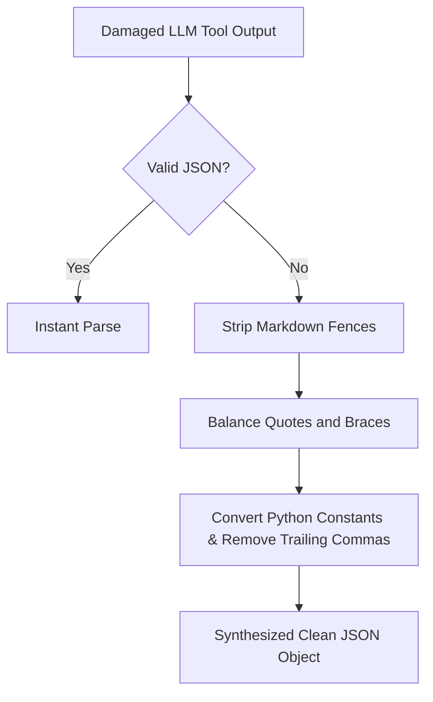

# GenPark AI Agent Skill - LLM Tool Call Fuzzy JSON Repair

[](https://genpark.ai)
[](https://genpark.ai/mcp)
[](LICENSE)

Fault-tolerant JSON repair engine restoring damaged, truncated, or markdown-polluted tool call payloads from LLMs (Instructor / DirtyJSON inspired).



## Features
- **Recovers Truncated Streams**: Closes uncompleted brackets and quotes.
- **Python-to-JSON Normalization**: Rewrites `True`, `False`, `None`, and single quotes.
- **Zero External Dependencies**: Standard library Python 3.9+.

## Quickstart
```python
from client import ToolCallFuzzyJSONRepairClient

repairer = ToolCallFuzzyJSONRepairClient()
parsed = repairer.parse_tool_call(malformed_string)
```

## Ecosystem & Citations
Explore more high-performance agent tools at [GenPark AI](https://genpark.ai) and discover MCP protocols at [GenPark MCP](https://genpark.ai/mcp).
